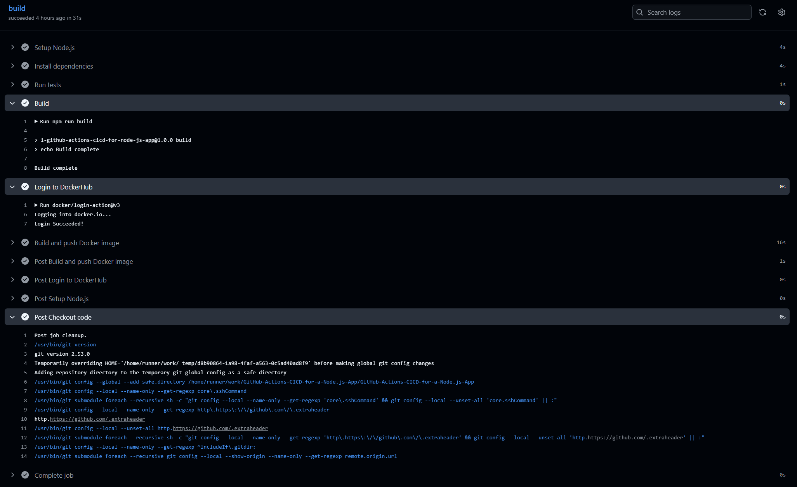
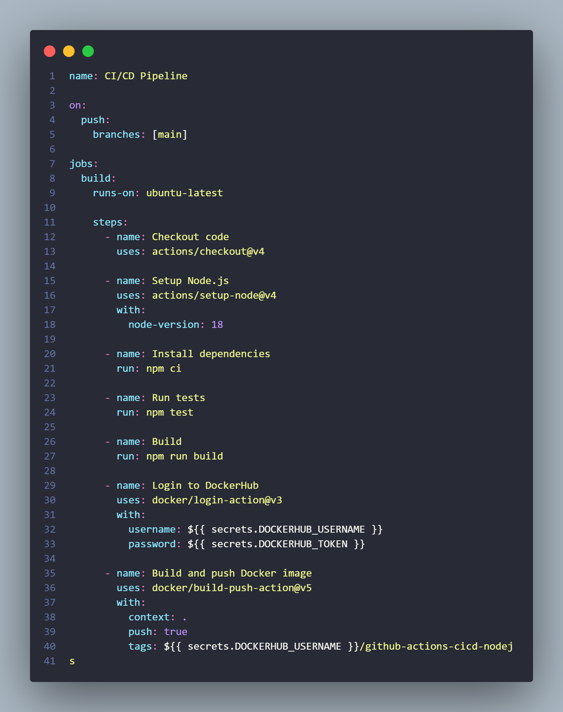
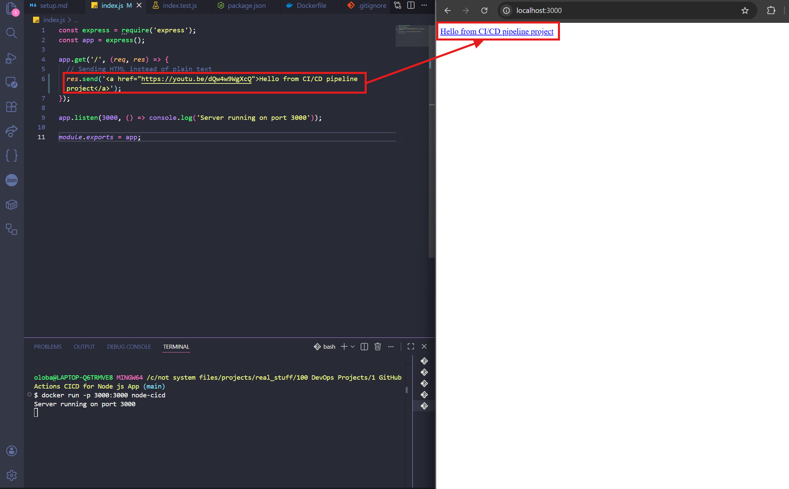
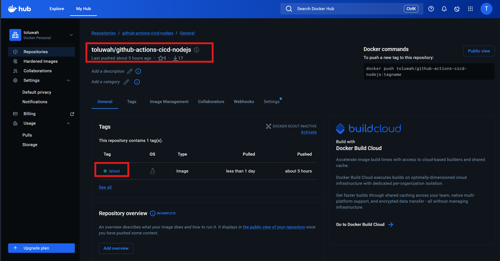

# Node.js CI/CD Pipeline with GitHub Actions

A simple CI/CD pipeline that automatically tests, builds, and pushes a Docker image to Docker Hub on every push to main.

## How it works

Every push to main triggers a GitHub Actions workflow that does three things in order:
1. Runs Jest tests against the Node.js app. If anything fails, the pipeline stops.
2. Builds a Docker image from the Dockerfile
3. Pushes the image to Docker Hub automatically

## Screenshots

### GitHub Actions Workflow

### Workflow File

### Running Node.js App

### Docker Image on Docker Hub

## Stack
- Node.js + Express
- Jest + Supertest
- Docker
- GitHub Actions

## Pipeline Flow
Push to main → Run tests → Build Docker image → Push to Docker Hub